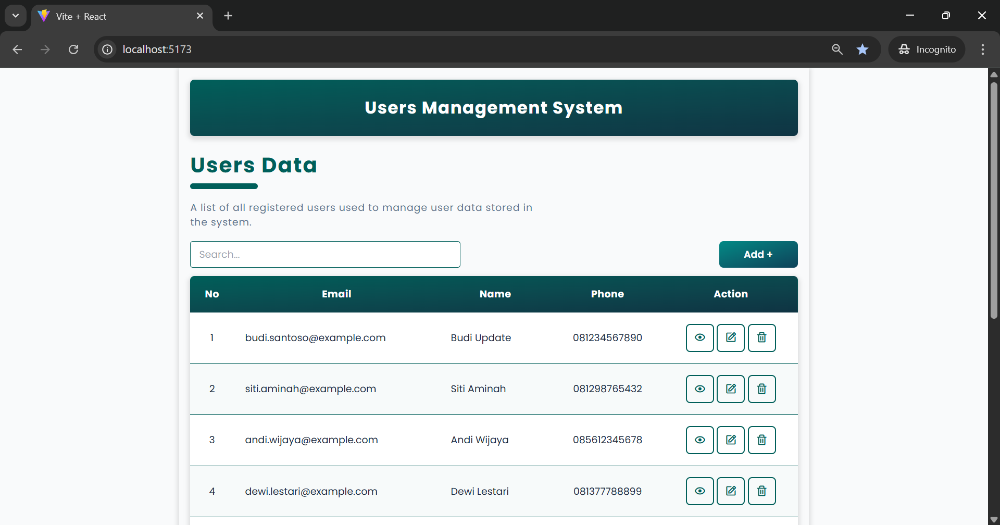

# Users Management System (React + JSON Server)

The Users Management System is a **React**-based web application used to manage user data with **CRUD (Create, Read, Update, Delete)** features. This application uses **React Router DOM** for page navigation, **JSON Server** as the REST API backend, and **Axios** for data communication.

---

## ✨ Key Features

- Display a list of all users
- Search for users by:
  - Email
  - Name
  - Phone number
- Add new user data
- View user data details
- Update user data
- Delete user data
- Page navigation using React Router
- Global layout with `Outlet`
- **404 Not Found** page for unavailable routes

---

## 🛠️ Technologies Used

- **React (Vite)**
- **React Router DOM (Nested Routes)**
- **Axios**
- **JSON Server**
- **Tailwind CSS**

---

## 📂 Project Structure

```
USERS-MANAGEMENT-SYSTEM/
├── public/
├── src/
│   ├── components/
│   │   ├── Create.jsx
│   │   ├── Detail.jsx
│   │   ├── Home.jsx
│   │   ├── NotFoundPage.jsx
│   │   └── Update.jsx
│   │
│   ├── Elements/
│   │   ├── Button/
│   │   │   └── Button.jsx
│   │   │
│   │   └── Input/
│   │       ├── Input.jsx
│   │       ├── InputContainer.jsx
│   │       └── Label.jsx
│   │
│   ├── layout/
│   │   └── Layout.jsx
│   │
│   ├── index.css     
│   └── main.jsx
|
├── db.json
├── index.html
├── package.json
├── README.md
└── vite.config.js
```

---

## 📦 Sample Data (db.json)

```json
{
  "users": [
    {
      "id": "1",
      "name": "Budi Update",
      "username": "budisant",
      "email": "budi.santoso@example.com",
      "phone": "081234567890",
      "website": "budisantoso.id"
    },
    {
      "id": "2",
      "name": "Siti Aminah",
      "username": "sitiaminah",
      "email": "siti.aminah@example.com",
      "phone": "081298765432",
      "website": "sitiaminah.com"
    }
  ]
}
```

---

## 🚀 Installing and Running the Application

1. **Clone Repository**
   ```bash
   git clone https://github.com/MFadhliAlHafizh/react-users-management-system
   cd react-users-management-system

2. **Install Dependency Proyek**
   Ensure you have pnpm installed.
   ```bash
   pnpm install

3. **Run JSON Server**
   ```bash
   pnpm run server
   ```

    Ensure the server is running at:
   ```bash
   http://localhost:5000/users

4. **Run in Development Mode**
   ```bash
   pnpm run dev
   ```

    Access the application at:
   ```bash
   http://localhost:5173

5. **Build for Production**
   ```bash
   pnpm run build

6. **Preview Build**
   ```bash
   pnpm run preview

---

## 📸 Preview Interface

> 

---
